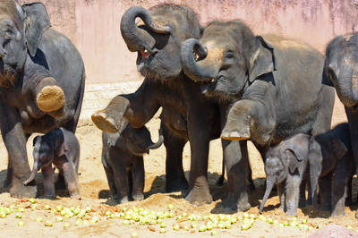

# Zoo

Das Respository gibt es auch online als [Demo](https://ki219.devstall.de/zoo/)


## index.html

Die [Index.html](https://github.com/Dzefo/KI2-19/blob/master/Zoo/index.html) ist unsere Startseite. In diesem Fall zeigt sie das Logo,
ein Bild von Elefanten und die Navigation zu den anderen Seiten.

#### Die Bilder erstellen wir mit einem ``````-Tag

```html

```

Hier gibt es diese [Attribute](https://www.w3schools.com/html/html_attributes.asp):

* id:
	* Definiert eine id für das Bild
	* Ermöglicht das spätere Zugreifen auf das Bild mittels CSS
* src:
	* Definiert den Pfad zu dem Foto, welches wir anzeigen wollen
* alt:
	* ```alt``` steht für Alternativ und ermöglicht uns, falls das Bild nicht sichtbar sein sollte, es mit Stichworten zu beschreiben

 ```h1``` steht für die Überschrift der Seite, nicht zu verwechseln mit dem ```title```-Tag im ```head```, welcher den Titel im Tab bestimmt.
Auch hier wird wieder eine ```id``` bestimmt.

Die Navigation wird mittels einer ```ul``` *( unordered List )* erstellt. Diese fasst wiederum mehrere ```li``` Elemente, welche jeweils ein ```a``` *(Anker)* Element fassen.

```html
<a href="sambesi.html">Sambesi</a>
```

Dieses besitzt nur ein Attribut:
* href:
	* Definiert den Pfad bzw. eine URL, zu dem weitergeleitet werden soll

```html
<html>
	<head>
		<title>Zoo</title>
		<link rel="stylesheet" href="style.css">
	</head>
	<body>
		
		
		<h1 id="headline">Erlebniswelten</h1>
		<div id="description">
			<ul>
				<li><a href="sambesi.html">Sambesi</a></li>
				<li><a href="dschungelpalast.html">Dschungelpalast</a></li>
				<li><a href="gorillaberg.html">Gorillaberg</a></li>
				<li><a href="outback.html">Outback</a></li>
				<li><a href="yukon_bay.html">Yukon Bay</a></li>
			</ul>
		</div>
	</body>
</html>
```
